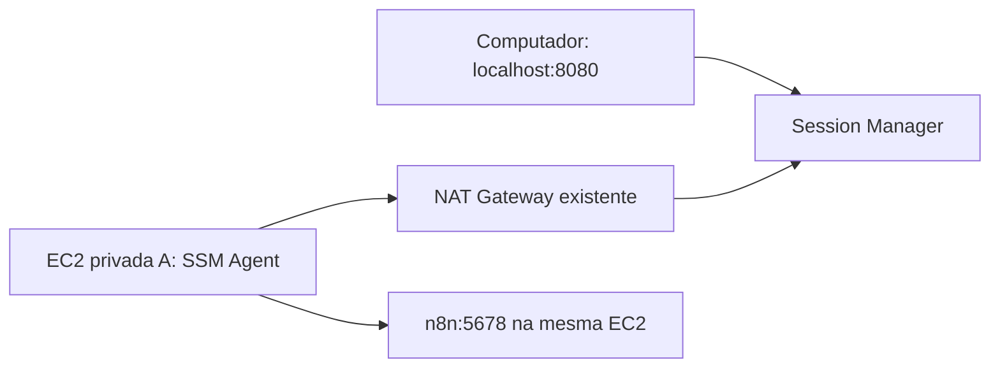

# EC2 e AWS Systems Manager Session Manager Port Forwarding

Laboratório Terraform para acessar um n8n na porta `5678` de uma EC2 privada pelo Session Manager. A rede é criada e mantida pelo projeto [`aws-vpc`](../aws-vpc), seguindo o mesmo padrão de código e consulta ao Parameter Store do [`aws-session-manager`](../aws-session-manager).

## Arquitetura



O túnel encaminha a porta local `8080` para a porta `5678` da própria EC2. A instância usa Amazon Linux 2023 ARM64, Graviton `t4g.small`, disco `gp3` criptografado e IMDSv2 obrigatório. Não recebe IP público nem chave SSH. Seu security group não possui regras de entrada e permite saída TCP 443 para comunicação com o Systems Manager e download dos pacotes e da imagem Docker.

## Estrutura

Todos os arquivos `.tf` ficam na raiz e compartilham um único backend, provider, conjunto de variáveis e estado. Os recursos da instância usam o prefixo `ec2_session_manager_port_forwarding_`, com as mesmas tags `Name`, `Environment` e `Terraform` do projeto de referência.

| Arquivo | Responsabilidade |
| --- | --- |
| `backend.tf` | Backend S3 |
| `providers.tf` | Provider AWS e região |
| `variables.tf` | Variáveis de entrada |
| `vpc_data.tf` | IDs da rede pelo Parameter Store |
| `vpc_outputs.tf` | Outputs da rede consumida |
| `ec2_session_manager_port_forwarding_data.tf` | AMI pública Amazon Linux 2023 ARM64 pelo SSM |
| `ec2_session_manager_port_forwarding_instance.tf` | EC2 e inicialização do SSM Agent |
| `ec2_session_manager_port_forwarding_iam.tf` | Role, política SSM e instance profile |
| `ec2_session_manager_port_forwarding_security_group.tf` | Security group e saída HTTPS |
| `ec2_session_manager_port_forwarding_outputs.tf` | ID, IP privado, security group e comandos de acesso |
| `live/sandbox/terraform.tfvars` | Configuração do laboratório |
| `live/sandbox/backend.tfvars` | Configuração do estado remoto |

## Pré-requisitos

Aplique primeiro `aws-vpc`, na mesma conta e região, para publicar os parâmetros abaixo. Este projeto consome a rede existente.

| Recurso | Parâmetro |
| --- | --- |
| VPC | `/vpc_id` |
| Subnet privada A | `/private_subnet_1a_id` |

A subnet privada A precisa de saída por NAT Gateway e DNS funcional, tanto para o SSM quanto para instalar manualmente o Docker e baixar a imagem do n8n. São necessários Terraform, AWS CLI, plugin do Session Manager e credenciais AWS. A identidade que abre o túnel precisa de permissões de Session Manager para a instância e para o documento `AWS-StartPortForwardingSession`; a role da EC2 não concede permissões ao operador.

## Aplicar

Configure credenciais AWS e preencha o bucket existente em `live/sandbox/backend.tfvars`. O estado usa a chave exclusiva `aws-session-manager-port-forwarding/sandbox/state`.

Revise `live/sandbox/terraform.tfvars`: região, ambiente, nome do projeto, tipo da instância, política SSM e porta local. Mantenha um tipo compatível com ARM64. `local_port_number` altera somente a porta no seu computador; o container do n8n publica a porta `5678` da EC2.

Na raiz deste projeto:

```bash
terraform init -backend-config=live/sandbox/backend.tfvars
terraform fmt -check -recursive
terraform validate
terraform plan -var-file=live/sandbox/terraform.tfvars -out=tfplan
terraform apply tfplan
```

Revise o plano antes do apply: ele cria uma EC2, disco, recursos IAM e security group. A EC2, o disco e o uso da rede existente geram custos.

## Consultar os outputs

```bash
terraform output vpc_id
terraform output private_subnet_1a_id
terraform output ec2_session_manager_port_forwarding_instance_id
terraform output ec2_session_manager_port_forwarding_private_ip
terraform output -raw ec2_session_manager_command
terraform output -raw ec2_session_manager_port_forwarding_command
terraform output -raw ec2_session_manager_port_forwarding_url
```

## Instalar a aplicação manualmente

O `user_data` apenas habilita e inicia o SSM Agent, já incluído na AMI:

```bash
systemctl enable --now amazon-ssm-agent
```

Aguarde o agente ficar disponível e copie e execute o comando exibido por:

```bash
terraform output -raw ec2_session_manager_command
```

Na sessão da EC2, instale o Docker e inicie o serviço manualmente:

```bash
sudo dnf install -y docker
sudo systemctl enable --now docker
```

A aplicação deste laboratório é o [n8n](https://n8n.io/). Em um shell com permissão para executar Docker (por exemplo, após `sudo -i`), execute:

```bash
docker run -d --name n8n -p 5678:5678 -e N8N_SECURE_COOKIE=false n8nio/n8n:nightly
```

O comando publica a porta `5678` e permite o acesso HTTP pelo túnel local. A instalação da aplicação é manual; o Terraform prepara somente a infraestrutura e o SSM Agent.

## Abrir o túnel

Depois de iniciar o container, no seu computador, copie e execute o comando exibido por:

```bash
terraform output -raw ec2_session_manager_port_forwarding_command
```

O comando tem este formato, com o ID real da instância:

```bash
aws ssm start-session \
  --region us-east-1 \
  --target i-0123456789abcdef0 \
  --document-name AWS-StartPortForwardingSession \
  --parameters 'localPortNumber=8080,portNumber=5678'
```

Mantenha essa sessão aberta. Em outro terminal:

```bash
curl http://localhost:8080
```

Também é possível abrir `http://localhost:8080` no navegador. O navegador exibirá a interface do n8n. Se você alterou `local_port_number`, use a URL exibida no output. Encerre o túnel com `Ctrl+C`.

O encaminhamento utiliza o [documento de port forwarding do Session Manager](https://docs.aws.amazon.com/pt_br/systems-manager/latest/userguide/session-manager-working-with-sessions-start.html#sessions-start-port-forwarding), com o plugin instalado no computador local.

## Diagnóstico

Se ocorrer `TargetNotConnected`, confira a região, a role da EC2, a saída HTTPS e a rota pelo NAT Gateway. Para verificar o serviço, abra a sessão interativa usando o comando de `ec2_session_manager_command` e execute:

```bash
sudo systemctl status amazon-ssm-agent docker
sudo docker ps -a --filter name=n8n
sudo docker logs n8n
curl http://localhost:5678
sudo tail -n 100 /var/log/cloud-init-output.log
```

Se a porta local já estiver ocupada, altere `local_port_number` e aplique novamente para atualizar o output do comando.

## Remoção

```bash
terraform plan -destroy -var-file=live/sandbox/terraform.tfvars -out=tfplan.destroy
terraform apply tfplan.destroy
```

Esse comando remove apenas recursos do estado deste projeto. A rede pertence ao estado de `aws-vpc`.

## Licença

Distribuído sob a licença MIT. Consulte [LICENSE](LICENSE).
